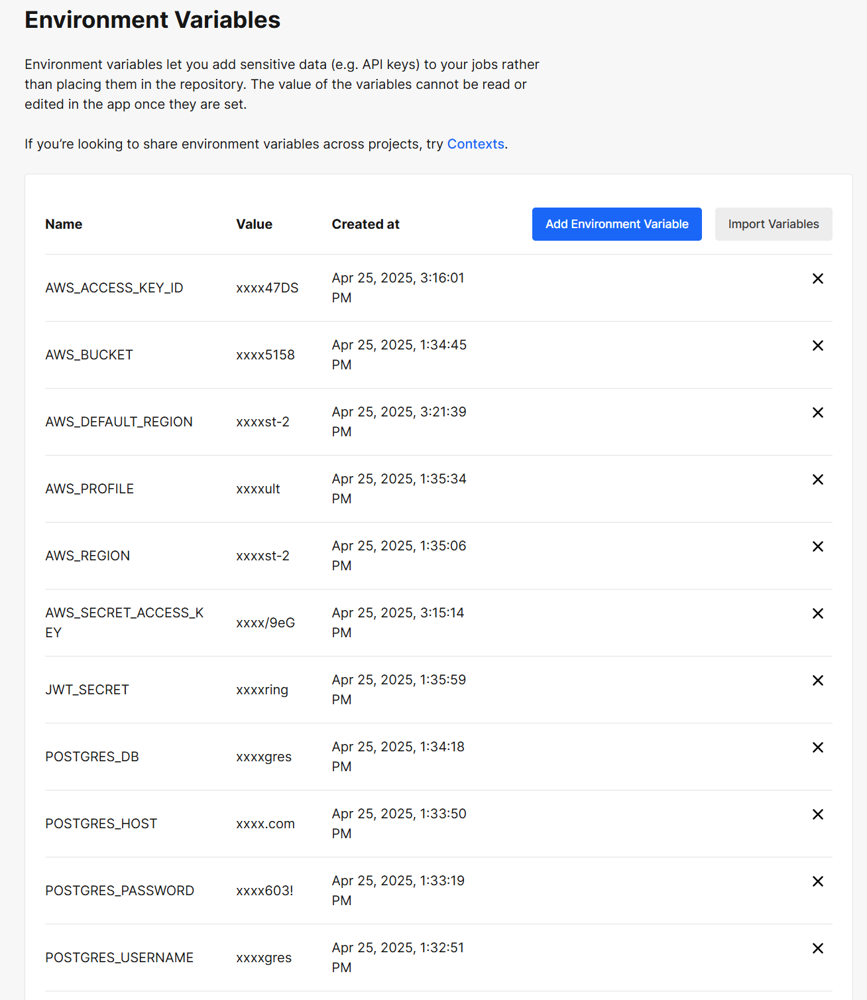
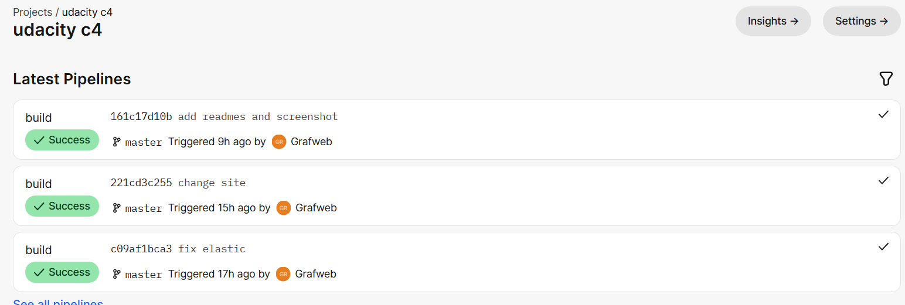

## Project Overview

This project is simple application that includes angular front-end for user and backend to provide API.

The main feature of this project is:

- Login
- Add new feeds
- View feeds

## Project Link

Frontend: http://mybucket033212455158.s3-website.us-east-2.amazonaws.com/home,
Backend: http://udagram-api-dev.us-east-1.elasticbeanstalk.com/api/v0,

## Project Setup

1. Clone source from repository: https://github.com/Grafweb/nd0067-c4-deployment-process-project-starter.git
2. In AWS, provision a publicly available RDS database running Postgres.
3. In AWS, provision a s3 bucket for hosting the uploaded files.
4. Setup ENV variables:

```
export POSTGRES_USERNAME=postgres     // Postgres username
export POSTGRES_PASSWORD=postgres     // Postgres password
export POSTGRES_HOST=''               // Postgres Host
export POSTGRES_DB=postgres           // Database name
export AWS_PROFILE=default            // AWS Profile
export AWS_BUCKET=my-udagram          // S3 bucket
export AWS_DEFAULT_REGION=us-east-1   // AWS default region
export AWS_REGION=us-east-1           // AWS region
export AWS_PROFILE=default            // AWS profile
export JWT_SECRET=mysecretstring      // JWT secret key
export PORT=5432                      // Posgres Port
export AWS_ACCESS_KEY_ID=             // AWS Acess Key ID
export AWS_SECRET_ACCESS_KEY=         // AWS Secret Access Key

```

5. Run the API, from the root of repo, navigate to api folder `cd udagram/udagram-api` folder to install the node_modules `npm i -f`. After installation is done, start the API in dev mode with `npm run dev`
6. Without closing terminal in step 5. Open the new terminal, navigate to frontend folder `cd udagram/udagram-frontend` to install the node_modules `npm i -f`. After installation is done, start the frontend in dev mode with `npm run start`.

## AWS Setup

Provision the necessary AWS services needed for running the application:

1. In AWS, provision a publicly available RDS database running Postgres.
2. In AWS, provision an S3 bucket for hosting the uploaded files.
3. In AWS, deploy the API on Elastic Beanstalk and add the API link to the `environment.prod.ts` file in the `udagram-frontend > src > environments`

### Variables enviroment in Elastic Beanstalk

You can do that in aws configuriation panel or with comand cli
eb setenv key=value


### Variables enviroment in Circleci



### Sample Build pipeline in Circleci


